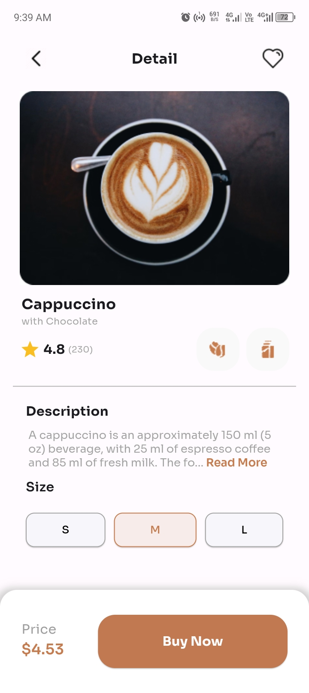

## Project Description

This Flutter project is a simple e-commerce app showcasing a product page for a beverage called "Cappuccino". It includes features such as displaying images, titles, ratings, descriptions, size selection, and price information.

### Features:
- Display of product image and title.
- Rating section showing the product's average rating and number of raters.
- Description section with a maximum character limit and a "Read More" option.
- Size selection section allowing users to choose between different sizes.
- Price section displaying the price based on the selected size.
- Buy Now button for purchasing the product.

## Screenshots

## How to Run the Project

1. Clone the repository to your local machine.
2. Open the project in your preferred Flutter development environment.
3. Ensure you have all dependencies installed by running `flutter pub get`.
4. Run the project on an emulator or physical device using `flutter run`.